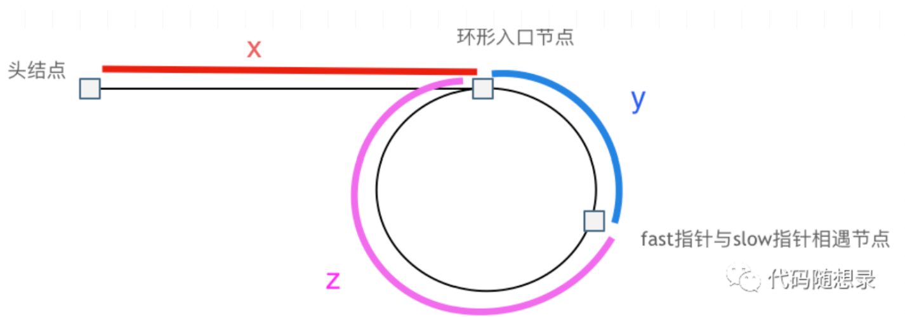

```java
// Definition of ListNode
class ListNode{
    int val;
    ListNode next;
    ListNode(){}
    ListNode(int val){
        this.val = val;
    }
    ListNode(int val,TreeNode next){
        this.val = val;
        this.next = next;
    }
}
```

## 1. 环形链表（142）



1. 寻找相遇节点

    (x + y) * 2 = x + y + n (y + z)

2. 相遇节点到环的入口距离相同

    x = (n - 1) (y + z) + z